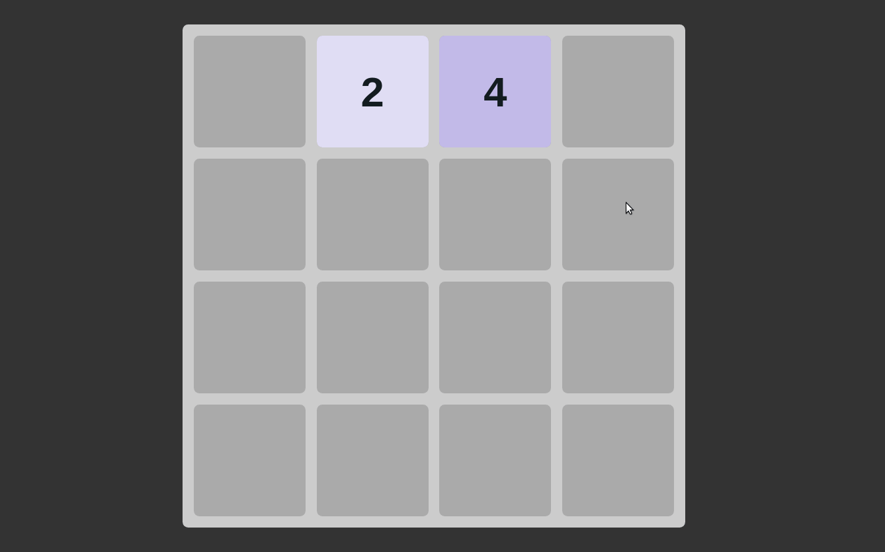

# 2048

> I was really bored during my vacations so I thought why don't we play a game, or even better ~ Make one 

Alot of lessons to learn here, thought I had Javascript under the belt but man was I knocked of my pedestel while working on this project.

## Built With

- HTML / CSS / JavaScript 

## Live Demo

- [GH-Pages Link](https://zhadier.github.io/two-zero-four-eight)

## Getting Started

### To launch the project locally:

#### Step 1:

- Clone this repo locally using git and the following git command

  git clone https://github.com/zhadier/two-zero-four-eight

#### Step 2:

- Open the cloned folder in a code editor of your choice
- Run npm install (npm and node are prerequisites)
- Run npm start (To show in live server)
- Run npm test (To see jest testing results)

## Authors

👤 **Zeeshan Haider**

- GitHub: [@zhadier](https://github.com/zhadier)
- LinkedIn: [Zeeshan Haider](https://www.linkedin.com/in/zhadier39/)

## 🤝 Contributing

Contributions, issues, and feature requests are welcome!

Feel free to check the [issues page](../../issues/).

## Show your support

Give a ⭐️ if you like this project!
We would love to hear your thoughts and ideas 🖤

## Acknowledgments

- Made following Web Dev simplified's amazing tutorial

## 📝 License

This project is [MIT](./MIT.md) licensed.
